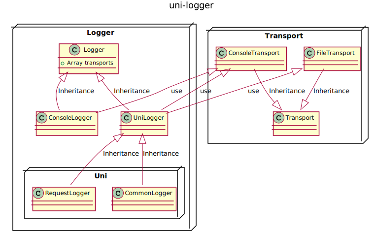

# uni

> TypeScript 版**云原生互联网应用开发框架**。

## 特性

总体来说，Uni 框架采用了中间件的方式，来实现路由、日志等功能，并且采用 Router-Controller-Service 的架构模式，使得开发只需要关注业务逻辑，工程上的事情只需要通过配置即可完成。

## 安装

```shell
npm i @jeff-tian/uni
```

## 日志


